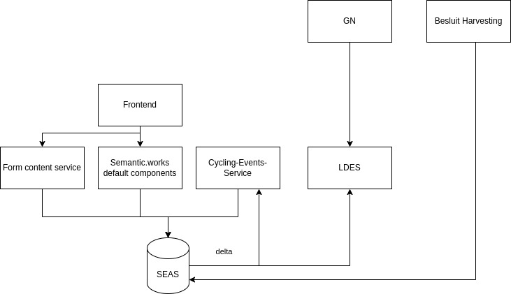

# Architecture

This file briefly describes the architecture envisaged in this hackathon

## Semantic.works Default components

This box abstracts away the default components of a semantic.works stack, like the identifier, dispatcher, login, resources, ... components. There is not much special about them

## LDES

This feed watches for delta messages published by the SEAS database and publishes Agendapunten that are created so Gelinkt Notuleren (GN) can pick them up. The AgendaPunt instances are created by the Cycling Events service (see later).

As we need to provide access to our data as a rich source where this information is available, but we don't want to expose our sparql, endpoint, we also publish the request instances and route segments to be picked up by e.g. centrale-vindplaats. [Challenge 3]

By creating AgendaPunt instances ready for GN to pick up we allow the Local government to reuse the tools they already use for decisions and we provide GN with a premade AgendaPunt instance that they can simply assign to the session they want. This should make it as easy as possible for the Local governments to take decisions as it matches their existing process in GN. [Challenge 2]

## Besluit Harvesting

As the Local Governments continue with their normal process and publish Besluit instances for Agendapunt instances, they will also add Besluit instances to the AgendaPunten that we created. We watch for those besluit instances that are harvested and use them to further the application state on our end. A rejection will put the entire request status to rejected. If all related AgendaPunt instances get an approval, the whole Request is approved.

As these decisions will not come in yet in this hackathon, we created a mock endpoint in the Cycling Events Service to simulate incoming Besluit instances instead and will not add actual Besluit harvesting.

## Cycling Events service

This service generates the AgendaPunt instances based on the route segments that are created in the frontend. An AgendaPunt is created for every Bestuurseenheid of a Local government based on the `adres:gemeentenaam` part of the Adres instance linked to a Route segment. This way, the organizer of the event can focus on providing the information (only once) on which streets they will cross, without having to fill out this form multiple times for every Commune and contact the relevant parties. Our app will do this for them automatically. [Challenge 1]

It's important to note that for this mock, the `adres:gemeentenaam` is matched based on string matching instead of linked data. This is prone to errors. In the true implementation, the app will automatically show the Commune that was found based on the address and link it properly to the segment. That way the user will see the Commune and be able to correct any mistakes. It also makes our data of (much) higher quality.

We reuse the [OSLO Omgevingsvergunning](https://data.vlaanderen.be/ns/omgevingsvergunning) application profile for the relevant classes in our model so when we publish our data, it will be instantly understandable for other applications.
