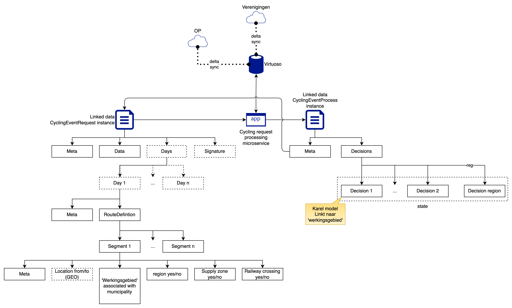

Namespace: cycling-poc
@prefix cycle: <https://example.com/ns/cycle> .
@prefix ext: <https://semtatic whatever redpencil ext>

# CyclingEventRequest form result

## CyclingEventRequest model

Nl. 'Aanvraag voor wielerwedstrijd

* Model: 'CyclingApplication'
* Name (string)
* Days (List[CyclingApplicationDay])
* Organizer (simplified: name of person, final: linked data ref to person?)
* SafetyCoordinator (simplified: name of person, final: linked data ref to person?)
* PublicityCaravan (simplified boolean yes/no)
* PoliceSupport (simplified boolean yes/no)
* RouteDefinition (RouteDefinition)

## CyclingApplicationDay

* Model 'CyclingApplicationDay'
* Date (day of year)
* StartTime (time of day)
* EndTime (time of day)

## Route definition model

* Model 'RouteDefintion'
* Day (CyclingApplicationDay)
* CompetitionSegments (List[CompetitionSegment])

## Competition segment model

* Model 'CompetitionSegment'
* LocationFrom, LocationTo (Unknown for poc, geo stuff left out for now)
* Municipality
* RegionalRoad (For hackaton boolean yes/no)
* ProvincialRoad (For hackaton boolean yes/no)
* Railwaycrossings (List string)

---

Other models directly in resources.lisp.

